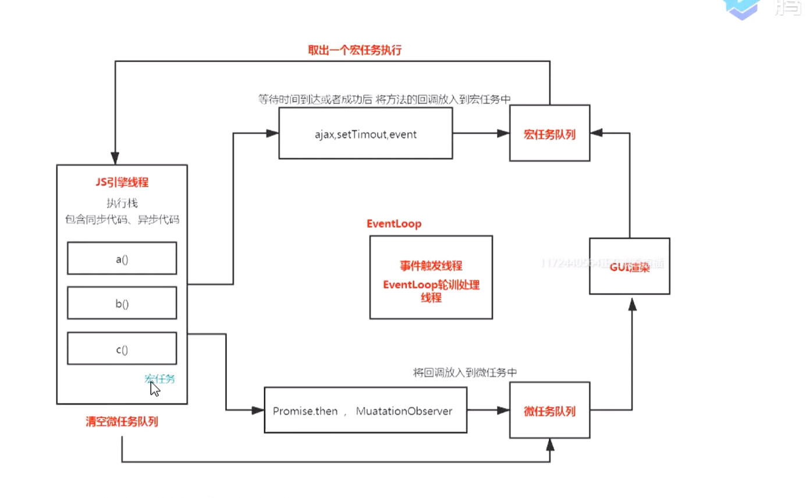

<!--
 * @Author: your name
 * @Date: 2020-03-11 11:11:18
 * @LastEditTime: 2020-04-29 16:21:41
 * @LastEditors: Please set LastEditors
 * @Description: In User Settings Edit
 * @FilePath: /webNotes/web/eventLoop/eventLoop.md
 -->

## EventLoop

### 什么是进程什么是线程

> 进程是系统进行资源分配和调度的一个独立单位，一个进程内包含多个线程

### 渲染进程

- GUI 渲染线程(页面渲染)

- js 引擎线程(执行 js 脚本)

- 事件触发线程(eventLoop 轮询线程)

- 事件(onClick)，定时器(setTimeout),ajax(xhr)(独立线程)

### 我们所谓的 js 为什么是单线程

> 一个线程在某个 dom 节点上添加内容，另一个线程删除了这个节点，那以哪个为准？

## eventLoop

> 在一个时间循环当中，异步事件返回的结果会放到一个任务队列当中，然后宏任务放宏任务队列，微任务放微任务队列

- 我们只需记住当当前执行栈执行完毕时会立刻先处理所有微任务队列中的事件，然后再去宏任务队列中取出一个事件。同一次事件循环中，微任务永远在宏任务之前执行。在当前的微任务没有执行完成时，是不会执行下一个宏任务的。

```javaScript
  console.log(1);             // 输出1
  setTimeout(function() {     // 添加到宏任务 macrotask:[console.log(2)]
      console.log(2);
  }, 0);
  new Promise(function(resolve) {   // 输出3
      console.log(3);
      resolve(Date.now());
  }).then(function() {
      console.log(4);               // 添加到微任务  microtask:[console.log(4)]
  });
  console.log(5);                   // 输出 5
  setTimeout(function() {
      new Promise(function(resolve) { // 添加到宏任务 macrotask:[console.log(2),newPromise...]
          console.log(6);
      }).then(function() {
          console.log(7);
      });
  }, 0);

 // 输出 1 3 5 4 2 6

```

```javaScript

    setTimeout(()=>{
        console.log(1)
    },0)

    new Promise((resolve)=>{
        resolve()
    }).then(()=>{
        console.log(2)
    })

// 输出 2 1
```

```javaScript

    setTimeout(_ => console.log(4))

        new Promise(resolve => {
           resolve()
           console.log(1)
        }).then(_ => {
            console.log(3)
            Promise.resolve().then(_ => {
                console.log('before timeout')
            }).then(_ => {
                Promise.resolve().then(_ => {
                console.log('also before timeout')
              })
           })
        })
    console.log(2)

// 输出 1 2 3 before timeout  also before timeout 4
```



### JS 运行机制

```javaScript
   console.log(1)
   setTimeout(function(){
       console.log(3)
   },0)
   console.log(2)
   // 输出 1,2,3

   for(var i=0 ;i< 4；i++){
       setTImeout(function(){
           console.log(i)
       }，1000)
   }
   // 输出 4

   for循环遇到一个setTimeout，并不是马上把setTimeout(）放到异步队列进行执行,而是等到一秒以后,才将其放到任务队列里面,一旦执行栈的所有同步任务执行完毕,即for循环执行完毕(此时i是4),系统就会读取已经存放的任务队列的setTimeout()(有四个)，所以输出4个4
```

1.  <font color=red>eventLoop</font>

    - 所有同步任务都在主线程上执行，形成一个执行栈，

    - 主线程之外,还存在一个任务队列，只要异步任务有了结果,就在任务队列中放置一个事件

    - 一旦执行栈中所有的同步任务执行完毕,系统就会读取任务队列，看看里面有哪些事件,那么对应的异步任务,于是结束等待状态,进入执行栈,开始执行

    - 主线程不断重复上面三步

2.  <font color=red>如何开启异步事件队列</font>

    - setTimeout 和 setInterval

    - DOM 事件

    - Promise

### 宏任务和微任务

- 微任务:promise.then MutationObserver

- 宏任务:script,ajax,事件,requestFrameAnimation,setTimeout,setInterval,setImmediate,MessageChannel,UI,rendering

### 浏览器的 eventLoop 和 node 11 版本的表现一致
