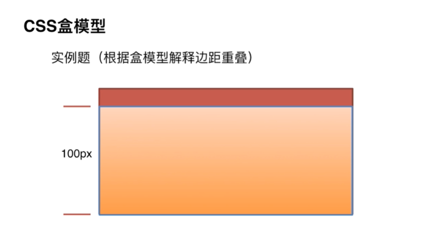

<!--
 * @Author: your name
 * @Date: 2020-03-04 14:15:10
 * @LastEditTime: 2020-04-29 16:27:14
 * @LastEditors: Please set LastEditors
 * @Description: In User Settings Edit
 * @FilePath: /weibo/Users/changcheng/Downloads/webNotes/web/flex/index.md
 -->

## css 盒模型

1.谈谈你对 css 盒模型的认识

- 盒模型包括：margin，padding，border，contenet
- 基本概念：标准模型+IE 模型.

  2.标准模型和 IE 盒模型的却别

- 标准模型的宽高指的是 content 内容的宽高
- IE 盒模型的宽高包含 padding 和 border 的宽高

  3.css 是如何设置这两种模型的

- 设置为标准盒模型：box-sizing:content-box;
- 设置为 IE 盒模型： box-sizing:border-box;
- 浏览器默认为 content-box;

  4.js 如何设置获取盒模型对应的宽高

- dom.style.width/height : 只能取内联样式的宽和高
- dom.currentStyle.width/height ：获取的是渲染之后的结果(只能 IE 支持)
- window.getComputedStyle(dom).width/height ：兼容性比 dom.currentStyle 好
- dom.getBoundingClientRect().width/height ：计算相对于视窗的绝对位置能拿到 left/top/width/height

  5.解释盒模型的边距重叠
  

- 通常情况下，如果给嵌套的子元素设置 margin，就会产生对父元素也产生同样的效果，然后这并不是我们想要的效果，我们只想对子元素设置 margin，那么我们应该怎么做呢

  1.给父元素设置边框

  2.给父元素添加 padding

  3.父元素设置 overflow:hidden，相当于给父级创建了 bfc，块级格式化上下文

  4.给子元素设置 inline-block(如果子元素是行内或者行内块级元素则不会产生边距的问题)

  5.子元素脱离文本流(浮动，绝对定位,fixed)

  6.BFC 的概念：

- BFC 决定了元素对其内容如何进行定位，以及与其他元素的关系和相互作用，具有 BFC 特性的元素可以看做是隔离了的容器，容器内的元素不会在布局上影响到外面的元素，可以理解为 BFC 为一个密闭的大箱子，箱子内的元素无论如何布局，都不会影响到外部

  7.形成 BFC 的条件：

- body 根元素
- 浮动元素：float 除 none 的值
- 绝对定位元素：position:absolute/fixed
- display：inline-block,table-cells,flex
- overflow 除了 visible 的值(hidden,auto,scroll)

  8.BFC 的作用

- 阻止外边距重叠，也就是块级标签竖直方向 margin 会以大的为准，也就是 margin 重叠，可以用 overflow:hidden 产生 bfc 解决
- 包含浮动元素
- 阻止元素被浮动元素遮盖

  9.解决浮动子元素脱离父级文本流

- overflow:hidden

## 弹性盒子

- flex-direction:设置排列方式

- justify-content:设置主轴方向的排列方式

- align-items:设置纵轴方向的排列方式

- flex-wrap:设置超出是否换行

- align-content:设置行对齐
