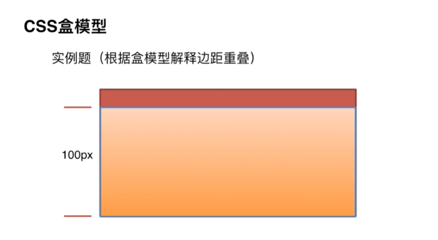

<!--
 * @Author: your name
 * @Date: 2020-03-04 14:15:10
 * @LastEditTime: 2020-03-16 11:12:15
 * @LastEditors: Please set LastEditors
 * @Description: In User Settings Edit
 * @FilePath: /weibo/Users/changcheng/Downloads/webNotes/web/flex/index.md
 -->
 ## css盒模型
1.谈谈你对css盒模型的认识

+ 盒模型包括：margin，padding，border，contenet
+ 基本概念：标准模型+IE模型.

2.标准模型和IE盒模型的却别

+ 标准模型的宽高指的是content内容的宽高
+ IE盒模型的宽高包含padding和border的宽高

3.css是如何设置这两种模型的

+ 设置为标准盒模型：box-sizing:content-box;
+ 设置为IE盒模型： box-sizing:border-box;
+ 浏览器默认为content-box;

4.js如何设置获取盒模型对应的宽高

+ dom.style.width/height : 只能取内联样式的宽和高
+ dom.currentStyle.width/height ：获取的是渲染之后的结果(只能IE支持)
+ window.getComputedStyle(dom).width/height ：兼容性比dom.currentStyle好
+ dom.getBoundingClientRect().width/height ：计算相对于视窗的绝对位置能拿到left/top/width/height

5.解释盒模型的边距重叠

+ 通常情况下，如果给嵌套的子元素设置margin，就会产生对父元素也产生同样的效果，然后这并不是我们想要的效果，我们只想对子元素设置margin，那么我们应该怎么做呢

  1.给父元素设置边框

  2.给父元素添加padding

  3.父元素设置overflow:hidden，相当于给父级创建了bfc，块级格式化上下文

  4.给子元素设置inline-block(如果子元素是行内或者行内块级元素则不会产生边距的问题)

  5.子元素脱离文本流(浮动，绝对定位,fixed)

6.BFC的概念：

+ BFC决定了元素对其内容如何进行定位，以及与其他元素的关系和相互作用，具有BFC特性的元素可以看做是隔离了的容器，容器内的元素不会在布局上影响到外面的元素，可以理解为BFC为一个密闭的大箱子，箱子内的元素无论如何布局，都不会影响到外部

7.形成BFC的条件：

+ body根元素
+ 浮动元素：float除none的值
+ 绝对定位元素：position:absolute/fixed 
+ display：inline-block,table-cells,flex
+ overflow除了visible的值(hidden,auto,scroll)

8.BFC的作用

+ 阻止外边距重叠，也就是块级标签竖直方向margin会以大的为准，也就是margin重叠，可以用overflow:hidden产生bfc解决
+ 包含浮动元素
+ 阻止元素被浮动元素遮盖

9.解决浮动子元素脱离父级文本流

+ overflow:hidden

## 弹性盒子

+  flex-direction:设置排列方式

+  justify-content:设置主轴方向的排列方式

+  align-items:设置纵轴方向的排列方式

+  flex-wrap:设置超出是否换行

+  align-content:设置行对齐
