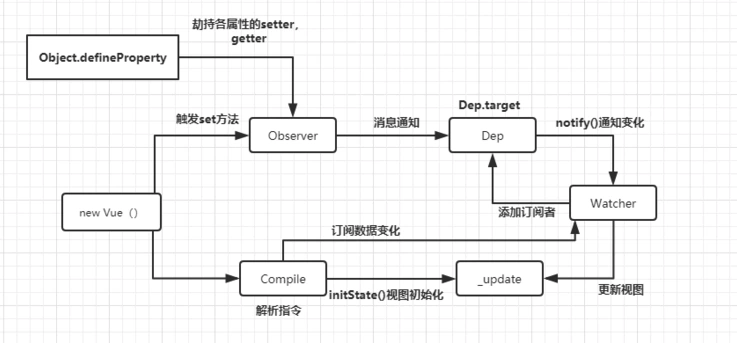

<!--
 * @Author: your name
 * @Date: 2020-03-16 11:10:41
 * @LastEditTime: 2020-04-29 16:27:22
 * @LastEditors: Please set LastEditors
 * @Description: In User Settings Edit
 * @FilePath: /webNotes/web/mvvm/index.md
 -->

### MVVM 框架类

1.  MVC

- View 传送指令到 Controller
- Controller 完成业务逻辑之后要求 model 改变状态
- model 将新的数据发送给 View,用户得到反馈

2. MVVM

优点：解决项目庞大之后 Controller 里的代码会越来越臃肿，于是有了 viewModel，由类似于 vue 框架来处理,进行一个数据的传递，所以开发者只用关注 model 和 view 就可以了，相对于 mvc，MVVM 是双向数据绑定

阮一峰：MVVM http://www.ruanyifeng.com/blog/2015/02/mvcmvp_mvvm.html

3.双向绑定原理

- Object.defineProperty

  1.Object.defineProperty 和 Reflect.defineProperty 的区别：Reflect.defineProperty 返回的是 Boolean 值,Object.defineProperty 返回的是一个新对象

3. MVVM 的设计模式

