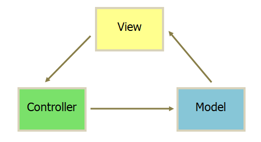
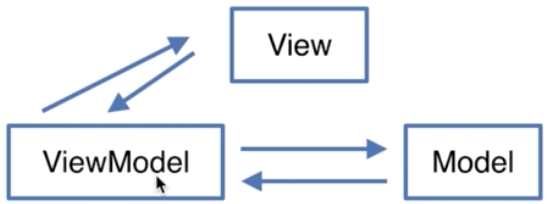
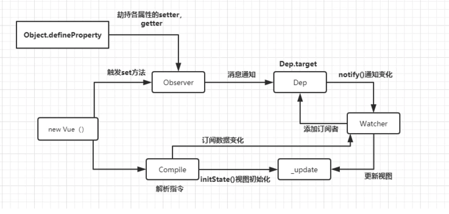

<!--
 * @Author: your name
 * @Date: 2020-03-16 11:10:41
 * @LastEditTime: 2020-03-16 11:31:43
 * @LastEditors: Please set LastEditors
 * @Description: In User Settings Edit
 * @FilePath: /webNotes/web/mvvm/index.md
 -->
### MVVM框架类

1.  MVC

+ View传送指令到Controller
+ Controller完成业务逻辑之后要求model改变状态
+ model将新的数据发送给View,用户得到反馈

 

2. MVVM
  
  优点：解决项目庞大之后Controller里的代码会越来越臃肿，于是有了viewModel，由类似于vue框架来处理,进行一个数据的传递，所以开发者只用关注model和view就可以了，相对于mvc，MVVM是双向数据绑定
  
 

 阮一峰：MVVM http://www.ruanyifeng.com/blog/2015/02/mvcmvp_mvvm.html

 3.双向绑定原理

+ Object.defineProperty

    1.Object.defineProperty和Reflect.defineProperty的区别：Reflect.defineProperty返回的是Boolean值,Object.defineProperty返回的是一个新对象

3. MVVM的设计模式

 
