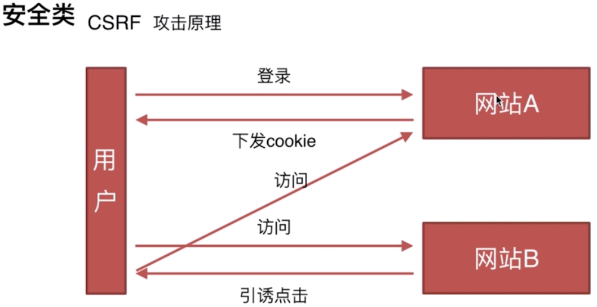
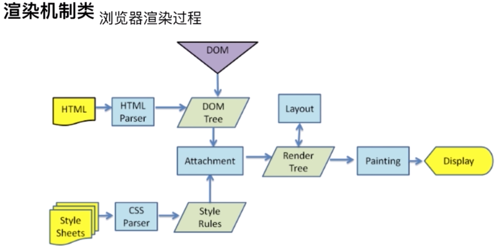

<!--
 * @Author: your name
 * @Date: 2020-03-16 11:00:28
 * @LastEditTime: 2020-04-13 17:07:04
 * @LastEditors: Please set LastEditors
 * @Description: In User Settings Edit
 * @FilePath: /webNotes/web/netWork/index.md
 -->

## 一个页面从输入 url 到页面加载完成显示，这个过程做了什么

1.浏览器通过 dns 解析将 url 地址解析为 ip（如果有缓存直接返回缓存,否则递归解析）

2.通过 dns 解析得到目标地址的 ip，与服务器建立 tcp 连接

- ip 协议：选择传输路线，负责找到

- tcp 协议:三次握手，分片，可靠传输，重新发送机制

  > 三次握手，四次挥手

  TCP 三次握手：1、客户端发送 syn 包到服务器，等待服务器确认接收。2、服务器确认接收 syn 包并确认客户的 syn，并发送回来一个 syn+ack 的包给客户端。3、客户端确认接收服务器的 syn+ack 包，并向服务器发送确认包 ack，二者相互建立联系后，完成 tcp 三次握手。四次挥手就是中间多了一层 等待服务器再一次响应回复相关数据的过程

  <br/>

3. 浏览器通过 http 协议发送请求(增加 http 的报文信息)

4. 服务器接收请求后，查库，读文件，拼接返回的 http 相应

5. 浏览器收到 html，然后渲染

6. 解析 html 为 dom,解析 css 为 css-tree,最终生成 render-tree,阻塞渲染

7. 遍历渲染树开始布局，计算每个节点位置大小信息

8. 将渲染树的每个节点绘制到屏幕

9. 加载 js 文件，执行 js 脚本

10. reflow（样式）,repaint（位置）

## OSI 协议

互联网的本质就是一系列网络协议，这个协议就叫做 OSI 协议，可以划分为七层

- 物理层，数据链路层，会话层，表示层，应用层，传输层，网络层

* 应用层:HTTP,FTP，DNF（与其他计算机进行通讯的一个应用服务，向应用提供应用服务时的通信活动）

* 传输层:TCP（可靠） UDP 数据传输(HTTP-TCP DNS-UDP),UDP 一般是用来网络直播

* 网络层:IP 选择传输路线(通过 IP 地址和 mac 地址)(使用 ARP 协议进行 mac 地址进行通信)

- 链路层:网络连接的硬件部分

## http 和 https 的区别

- Http 的缺陷:

1. http 不具备加密功能，http 报文使用明文发送

2. 无法确认你发送到的服务器就是真正的服务器

3. 无法阻止海量请求下的 dos 攻击

4. 返回的内容被篡改

Https 是 Http 建立在 SSL/TLS 安全协议上的(信息加密，完整校验，身份验证)

## Http 相关 Header 内容

1.缓存 Header

- 强 Cache-Control / expires

- private 客户端可以缓存

- public 客户端和代理服务器都可以缓存

- max-age=60 缓存内容将在 60 秒后失效

- no-cache 需要使用对比缓存验证数据,需要向服务器发送验证

- no-store 所有内容都不会缓存，强制缓存和对比缓存都不会触发(不缓存)

  2.跨域：Access-control

  3.压缩：Content-Encoding:gzip

  4.范围请求：range

  5.防盗链：referer(经常用于图片防盗，判断 referer 的请求地址)

  6.用户内核：user-agent

  7.单主机多域名：host

  8.多语言：accept-language

## Tcp 连接

- navigator.userAgent 的作用

1. 判断浏览器类型，采用兼容方案

2. 判断是否是移动端

3. 标识 H5 容器，方便调用 H5 接口

4. userAgent 的伪装成本很低，不要过于依赖

```javaScript

const desPort = 80;
const desHost = '123.57.205.204';
let allBuffer = null;
  const net = require('net')
  // 创建一个TCP服务器
  const client = net.createConnection(8080,127,0.0.1,function(){
    console.log('connect to sercer!')
    client.write(
      'GET / HTTP1.0\r\nHost:www.zhufengpeixun.cn\r\nUser-Agent:Mozilla/5.0(Macintosh;Intel Mac OS X 10_12_1) AppleWebkit/537.36(KHTML,like Gecko)chrome/64.0.3282.186 Safari/537.36\r\nAccept:text/html\r\nAccept-Language:zh-CN,zh;q=0.9\r\n\r\n'
    )
  })
  //
  client.on('data',function(data){
    console.log('----receive data-------');
    if(!allBuffer){
      allBuffer = data;
    }else{
      allBuffer = Buffer.concat([allBuffer,data]);
    }
  })

  client.on('error',function(err){
    console.log(err);
  })

  client.on('end',function(){
    console.log('connection end');
    const htmlContent = allBuffer.toString();
    // 解释页面的操作
    const ws = fs.createWriteStream(
      path.join(__dirname,'zhufeng.html')
    )
    ws.write(htmlContent)
  })
```

## 浏览器内核知识

- 浏览器内核:我们可以初步认为浏览器中负责将页面的字符转变成可视化图像的模块就是浏览器内核

> 通过相应的内容，我们可以看到内容中还存在很多外联资源，浏览器是如何处理的？

- 不同的外联资源，webkit 有不同的加载器，当浏览器解析到 url 地址时，调用特定的资源加载器，如果不是特殊资源，加载过程不会阻塞渲染过程。

> 著名的优化：”css 放在头部，js 放在尾部“，为什么？

- 一般来说 css 不会阻塞渲染过程，但 javaScript 资源在浏览器当中，会阻塞渲染过程的进行，如果放置在头部，渲染过程会暂停，造成"白屏"效果，但是现代浏览器优化做的很好，所以当阻塞渲染时，浏览器会开启新的线程继续渲染

> 浏览器在渲染之前或之后应该做哪些事情？

- 渲染之前会加载资源，渲染之后在 dom 或者 css 变化之后，重新进行布局计算和重渲染操作

> 移动端的浏览器和 pc 的刘安琪是否相同？

- 功能基本相同，但所运行的操作系统不同，渲染机制有差异

## 网页内容的组成

- charset：设置 html 文档的字符编码

       1. <meta charset="UTF-8">

- doctype：提供浏览器 html 版本信息

- head：html 头部

- viewPort:设置用户的可视区域

      1. <meta name="viewport" content="width=device-width, initial-scale=1.0, maximum-scale=1.0,minimum-scale=1.0,user-scalable=0" />

  width:控制 viewPort 的大小

  height:和 width 对应，指定高度

  initial-scale:初始用户缩放比例，也即是当页面第一 load 的缩放比例

  maximum-scale：允许用户缩放的最大比例

  minimum-scale:允许用户缩放的最小比例

  user-scalable:用户是否可以手动缩放

> name:设置文档的名称

- charset:关键词，即用于说明网页包含的关键信息等，从而提高被搜索引擎搜索到的概率，一般设置多个关键字

      1.  <meta name='keywords' content='淘宝，天猫，古董'>

- keywords:关键词，即用于说明网页包含的关键信息等，从而提高被搜索引擎搜索到的概率，一般设置多个关键字

      1.  <meta name='keywords' content='淘宝，天猫，古董'>

- description:描述，用于描述网页的内容，主题等，最多容纳 1024 个字符，但是搜索引擎只展示前 175 个字符

      1. <meta name='description' content='淘宝，天猫，古董'>

- author:作者

      1. <meta name='author' content='常成'>

- robots:机器人，seo 优化

       1. <meta name='robots' content='常成'>

> http-equiv:相当于 http 文件头作用，向浏览器传回一些有用信息

<br/>

- expires：期限,可以用于网页的到期时间，一旦网页过期，必须到服务器重新上传

```javaScript

  ＜meta http-equiv="expires" content="Wed, 20 Jun 2007 22:33:00 GMT"＞

```

- set-cookie:如果网页到期，存盘的 cookie 将删除

```javaScript

  ＜meta http-equiv="Set-Cookie" content="cookievalue=xxx;expires=Wednesday, 20-Jun-2007 22:33:00 GMT； path=/"＞

```

- content-type:设置显示字符集

```javaScript

       1. <meta http-equiv="Content-Type" content="text/html; charset=Utf-8">
```

- Content-Language:设置语言

```javaScript

      1.  <meta http-equiv="Content-Language" content="zh-CN">
```

## Http 协议类

<font color=red>http 主要特点</font>

- 简单快速 灵活 无连接 无状态

2. <font color=red>http 报文组成</font>

#### 请求报文

- 请求行：http 方法，页面地址,http 协议，版本

##### 请求头

- User-Agent：产生请求的浏览器类型
- Accept：客户端可识别的内容类型列表
- Host：请求的主机名，允许多个域名同处一个 IP 地址，即虚拟主机。

##### 空行

- 告诉服务端下面是请求体了

##### 请求体

- 请求内容

  3.<font color=red>响应报文</font>：状态码，响应头，空行，响应体

  4.<font color=red>Http 方法</font>

- Get:获取资源
- Post:传输资源
- Put：更新资源
- Delete:删除资源
- Head:获取报文首部

  5.<font color=red>GET 和 Post 的区别</font>

- GET 回退时是无害的，而 post 会再次请求
- get 的 url 是可以被收藏的，但 post 不行
- get 会被浏览器主动缓存，而 post 不会，除非手动设置
- get 只能进行 Url 编码，而 post 支持多种编码方式
- get 参数会被完整保留在浏览器的历史记录中，而 post 不会
- get 参数在 url 传送的参数有长度限制，而 post 没有限制
- get 参数只接受 ASCII 字符，而 post 没有限制
- get 比 post 更不安全，因为参数会暴露在 url 上，所以不能用来传递敏感信息
- get 参数通过 url 传递，post 放在 requsetBody 中

  6.<font color=red>Http 状态码</font>

- 1xx 指示信息:代表请求已经被接收正在处理
- 2xx 成功:代表请求已经被成功接收
- 3xx 重定向:要完成请求必须进行进一步操作
- 4xx 客户端错误:请求有语法错误或者请求无法实现
- 5xx 服务器错误:服务器未能实现合法的请求

##### <font color=red>常用的状态码</font>

- 204:没有相应内容

* 206:客户发送一个带有 Range 头的 get 请求，客户端完成了它，一般用来音频视频的分段播放，用来传递范围区间

* 301:所请求页面已转移到新的 Url，永久重定向

* 302:所请求页面已经转移到新的 url

* 304:客户端有缓冲的文档并发出了一个条件性的请求，服务器告诉客户，原来缓冲的文档还可以用

* 400:客户端语法有错误，不能被服务器理解

* 401:请求未经授权

* 403:对请求页面的访问被禁止

* 503:负载均衡挂了

  7.<font color=red>Http 持久连接</font>

* keep-Alive，(1.1 版本才支持)当使用此功能时，keep-alive 功能使客户端到服务端的连接持续有效，当出现对服务器的后续请求的时候，keep-alive 功能避免了建立或者重新创建连接

  8.http 管线化

##### <font color=red>什么是管线化</font>

在使用持久连接的情况下，某个连接消息的传递类似于

<font color=red>请求 1 -> 响应 1 -> 请求 2 -> 响应 2</font>

管线化:某个连接上的消息变成了类似这样

<font color=red>请求 1 -> 请求 2 -> 请求 3 -> 响应 1 -> 响应 2 -> 响应 3</font>

【注】

1. <font color=red>那么持久连接和管线化的区别在于：</font>

持久连接的一个缺点是请求和响应式是顺序执行的，只有在请求 1 的响应收到之后，才会发送请求 2，而管线化不需要等待上一次请求得到响应就可以进行下一次请求。实现并行发送请求

2. 只有 GET 和 HEAD 要求可以进行管线化，而 POST 则有所限制

3. 初次创建连接时也不应启动管线机制，因为对方（服务器）不一定支持 HTTP/1.1 版本的协议。

4.HTTP1.1 要求服务器端支持管线化，但并不要求服务器端也对响应进行管线化处理，只是要求对于管线化的请求不失败，而且现在很多服务器端和代理程序对管线化的支持并不好，现代浏览器 Chrome 和 Firefox 默认并未开启管线化支持。

9.<font color=red>http 的多路复用</font>

在 HTTP/1 中，每次请求都会建立一次 HTTP 连接，也就是我们常说的 3 次握手 4 次挥手，这个过程在一次请求过程中占用了相当长的时间，即使开启了 Keep-Alive ，解决了多次连接的问题，但是依然有两个效率上的问题：

第一个：串行的文件传输。当请求 a 文件时，b 文件只能等待，等待 a 连接到服务器、服务器处理文件、服务器返回文件，这三个步骤。我们假设这三步用时都是 1 秒，那么 a 文件用时为 3 秒，b 文件传输完成用时为 6 秒，依此类推。（注：此项计算有一个前提条件，就是浏览器和服务器是单通道传输）
第二个：连接数过多。我们假设 Apache 设置了最大并发数为 300，因为浏览器限制，浏览器发起的最大请求数为 6，也就是服务器能承载的最高并发为 50，当第 51 个人访问时，就需要等待前面某个请求处理完成。
HTTP/2 的多路复用就是为了解决上述的两个性能问题。
在 HTTP/2 中，有两个非常重要的概念，分别是帧（frame）和流（stream）。
帧代表着最小的数据单位，每个帧会标识出该帧属于哪个流，流也就是多个帧组成的数据流。
<font color=red>多路复用，就是在一个 TCP 连接中可以存在多条流。换句话说，也就是可以发送多个请求，对端可以通过帧中的标识知道属于哪个请求。通过这个技术，可以避免 HTTP 旧版本中的队头阻塞问题，极大的提高传输性能。</font>

## 通信类

1. <font color=red>服务器同源策略(协议，域名，端口)</font>

- 同源策略：限制从一个源加载的文档或脚本如何与来自另一个源的资源进行交互，
  这是一个用来隔离恶意文件关键的安全机制

- cookie，LocalStorage,indexDB 无法读取

- DOM 无法获得

- ajax 无法发送

2. <font color=red>前后端如何通信</font>

- ajax

- webSocket

- CORS：跨域请求，后端设置请求头许可，Access-Control-Allow-Origin：\*

3. <font color=red>手写原生 ajax 请求</font>

```javaScript
function request(option) {
  if (String(option) !== '[object Object]') return undefined
  option.method = option.method ? option.method.toUpperCase() : 'GET'
  option.data = option.data || {}
  var formData = []
  for (var key in option.data) {
    formData.push(''.concat(key, '=', option.data[key]))
  }
  option.data = formData.join('&')

  if (option.method === 'GET') {
    option.url += location.search.length === 0 ? ''.concat('?', option.data) : ''.concat('&', option.data)
  }

  var xhr = new XMLHttpRequest()
  xhr.responseType = option.responseType || 'json'
  xhr.onreadystatechange = function () {
    if (xhr.readyState === 4) {
      if (xhr.status === 200) {
        if (option.success && typeof option.success === 'function') {
          option.success(xhr.response)
        }
      } else {
        if (option.error && typeof option.error === 'function') {
          option.error()
        }
      }
    }
  }
  xhr.open(option.method, option.url, true)
  if (option.method === 'POST') {
    xhr.setRequestHeader('Content-Type', 'application/x-www-form-urlencoded')
  }
  xhr.send(option.method === 'POST' ? option.data : null)
}
// 调用
request({
    url: 'api',
    method: 'POST',
    data: {},
    success: function (res) {

    },
    error: function (err) {

    }
})
```

4. <font color=red>跨域通信的几种方式</font>

- JSONP:动态加载 script 脚本，传回调名，然后获取函数里面的参数，arguments[0]

- Hash

```javaScript
    // 伪代码
    // 利用hash，场景是当前页面A通过iframe嵌入跨域的页面B
    // A中的代码
    var B = document.getElementsByTagName("iframe");
    B.src = B.src + '#' + 'data'
    //在B中的代码
    window.onhashchange = function(){
        var data = window.location.hash;
    }
```

- postMessage

```javaScript
   // postMessage
   // 窗口A(http://A.com)向跨域的窗口B(http://B.com)发送信息
   Bwindow.postMessage('data','http://B.com');
   //在B窗口中监听
   window.addEventListener('message',function(event){
       console.log(event.origin) // http://A.com
       console.log(event.source) // Bwindow
       console.log(event.data) // 'data'
   })
```

- WebSocket

```javaScript
    var ws = new WebSocket("wss://echo.websocket.org");
    // 建立连接，发送消息
    ws.open = function(evt){
        console.log("Connection open ...");
        ws.sned("This is message");
    }
    // 监听发送消息
    ws.onmessage = function(evt){
        console.log("Recived  Message:"+evt.data)
        ws.close()
    }
    // 监听关闭
    ws.onclose = function(evt){
        console.log("connection closed")
    }
```

- CORS

```javaScript
    // CORS
    // url(必须) options(可选)
    fetch("http://W.JSON",{

    }).then(function(response){

    }).catch(function(err){
        // 出错的，等于then的第二个参数
    })
```

## 安全类

- <font color=red>CSRF</font>

  因为登陆了网站 A 之后，已经下发了 cookie，点击 B 网站的时候,诱导发送 get 请求,这时候的话用户发送的请求就携带 cookie 了

  攻击条件:

  - 在 A 网站已经登陆过，如果没有登录肯定拿不到 cookie，就会让他登录
  - 接口存在未校验 refer 等情况

  解决方案:

  - 后台校验请求头的 refer

  - token 验证

  - 隐藏令牌:隐藏在 header 头当中，把信息校验

  

- <font color=red>XSS</font>

  跨域脚本攻击

  攻击方式：输入框脚本注入

### 浏览器渲染机制

1. <font color=red>什么是 DOCTYPE 以及作用</font>

- DOCTYPE 是用来声明文档类型和 DTD 规范的，一个主要用途是文件合法性校验，如果文件代码不合法，那么浏览器解析便会出一些差错。

1. HTML5

```javaScript
 <!DOCTYPE html>
```

2. <font color=red>HTML 4.0 有两个模式：严格模式和宽松模式</font>



- DOM: Document Object Model，浏览器将 HTML 解析成树形的数据结构，简称 DOM

- CSSOM: Css Object Model,浏览器将 CSS 解析成树形的数据结构，简称 CSSOM

- Render Tree: DOM 和 CSSOM 合并生成 Render Tree

- Layout: 计算出 Render Tree 每个节点的具体位置

- Painting: 通过显卡，将 Layout 后的节点内容分别呈现在屏幕上

加载顺序：

- 当我们获取到 HTML 文件的时候，会自上而下进行加载，并在加载过程中解析和渲染

- 加载说的是获取资源文件的过程，如果在加载过程当中遇到外部的 css 文件和图片，浏览器会发送请求获取 css 文件和图片，这个过程是异步的，并不会影响 HTML 文件的加载

- 但是如果遇到 Js 文件，HTML 文件会挂起，等待 js 文件加载完再进行渲染

- 为什么 HTML 文件会等待 Js 文件加载，因为 JS 可以操作 DOM，导致后续 HTML 资源白白加载，所以会等待 JS 文件加载完成之后再进行渲染，所以 JS 文件引入要在 body 底部

2. <font color=red>重排(reflow)</font>

- DOM 结构当中各个元素都有自己的盒子模型，这些都需要浏览器根据各种样式来计算结果放在它该出现的位置，这个过程称为回流

1. 触发回流的条件

- 增加，删除，修改 DOM 节点，会导致回流或者重绘

- 移动 DOM 位置，css 动画之类的

- 修改 css 样式的时候

- resize 窗口的时候

- 修改网页默认字体的时候

3. <font color=red>重绘(repaint)</font>

- 当各种盒子的位置，大小，以及其他属性，例如颜色，字体大小确定下来的时候，浏览器便把这些元素按照各自的特性绘制一遍，于是页面的内容出现了，这个过程称之重绘制(repaint)

1. <font color=red>触发重绘条件</font>

- DOM 改动

- CSS 改动

4. <font color=red>如何降低重绘带来的影响</font>

- 使用 DocumentFragment 一次将节点添加进去，不过此方法在 IE 情况下并不会提速

  5.介绍下重绘和回流

- 回流必定会发生重绘，重绘不一定会引发回流

### 提升页面性能的几种方法

1. <font color=red>异步加载的方式</font>

- 动态脚本加载，defer，async

2. <font color=red>异步加载的区别</font>

- defer 实在 html 加载完毕之后才会执行,如果多个，按照加载的顺序依次进行执行

- async 是在加载完成之后立即执行，如果是多个,执行顺序和加载顺序无关

3. <font color=red>浏览器缓存</font>

   - 缓存的分类

（1）强缓存

- 不会向服务器发送请求，直接从缓存中读取数据，在 chrome 浏览器当中的 netWork 中能看到返回码是 200

```javaScript
   1) 强缓存
    Expires: Tue, 13 Aug 2019 08:23:24 GMT   // response header里的过期时间，如果在这个时间内，则命中强缓存
    Cache-Control: Cache-Control:max-age=3600  //60分钟内再次请求该资源就会命中强缓存

    Cache-Control:no-cache //不使用本地缓存，需使用协商缓存
                  no-store //禁止浏览器缓存数据，每次用户请求资源，都会向服务器发送一个请求
                    public //可以被所有用户缓存
                    private//只能被终端的浏览器缓存，不允许cdn等缓存服务器缓存
   // 如果两个标识符都有，按照最后一个为准

```

（2）协商缓存

- 向服务器发送请求，服务器会根据请求头中的参数来判断是否命中协商缓存，如果命中，则返回 304 的状态并带上新的 response header 通知浏览器从缓存中读取资源

```javaScript

   1) 协商缓存
   Last-Modified:Tue, 13 Aug 2019 08:23:24 GMT  //标识该资源最后修改的时间
   Etag：hash值 //告诉浏览器此文件在服务器的唯一标识

```

4. <font color=red>资源压缩合并，减少 http 请求</font>

5. <font color=red>面向对象的事件委托</font>

优点:减少 dom 循环遍历，优化性能，采用绑定在父元素的方法，子元素点击冒泡

```javaScript

    <ul class="content">
        <li>1<span class="del">x</span></li>
        <li>2<span class="del">x</span></li>
        <li>3<span class="del">x</span></li>
        <li>4<span class="del">x</span></li>
    </ul>

    class addEv{
            constructor(el){
                var dom = document.querySelectorAll(el)[0]
                this.el = dom
                dom.addEventListener("click",(evnet=>{
                   if(event.target.className.indexOf("del") > -1){
                    this.removeAddListener(evnet.target)
                   }
                }))
            }
            removeAddListener(childNode){
                this.el.removeChild(childNode.parentNode)
            }
        }
        window.addEventListener('DOMContentLoaded',()=>{
            new addEv('.content')
        })

```

### 前端错误监控

1. <font color=red>即时运行的错误</font>

- try catch

- window.onerror()：错误回传服务器，但是有跨域问题，需要在 js 文件引入的时候加上 crossorigin

2. <font color=red>资源加载的错误</font>

- object.onerror(): 例如图片之类的地址加载失败，可以在标签上添加 onerror 函数，然后相对应的函数内写捕获错误的具体代码

- performance.getEntries():获取加载资源的各项数据，大小，时间等等

- 自定义 error 事件：window.addEventListener

3. <font color=red>错误上报的原理</font>

- ajax 上传

- 利用 img 对象上报
