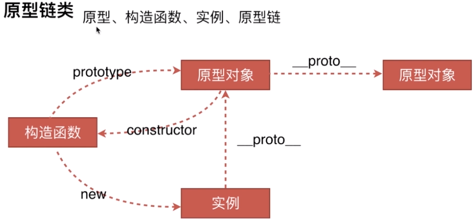
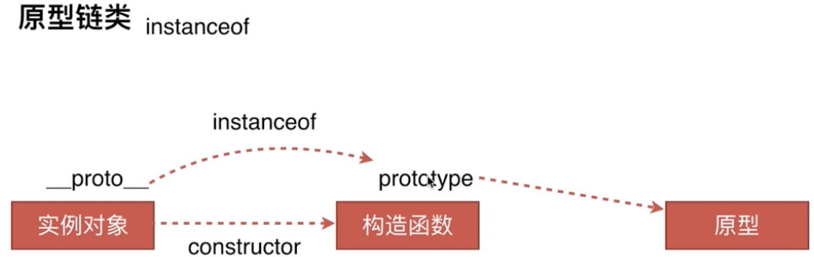
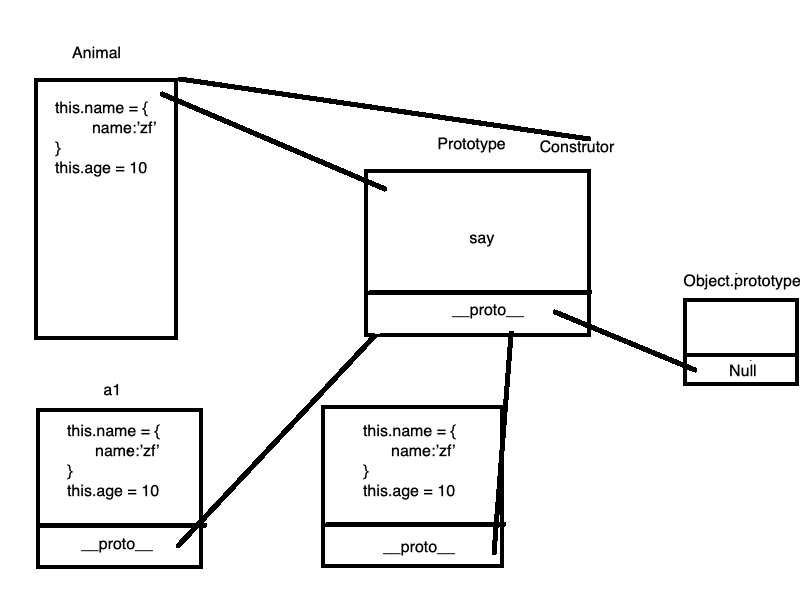

<!--
 * @Author: your name
 * @Date: 2020-03-16 11:03:03
 * @LastEditTime: 2020-03-26 15:16:28
 * @LastEditors: Please set LastEditors
 * @Description: In User Settings Edit
 * @FilePath: /webNotes/web/prototype/index.md
 -->

## 原型链



```javaScript
  // Es5 中没有类 用构造函数模拟类
  // 类中有两种属性 1）实例上的属性  2）公共属性
  function Animal(){
      if(! (this instanceof Animal)){
          throw new Error('不是继承与该构造函数')
      }
      this.name = {name:'zf'}
      this.ages = 10
  }
  Animal.prototype.say = function(){
      console.log('sy')
  }
  let a1 = new Animal()
  let a2 = new Animal()

```

1.<font color=red>创造对象的几种方法</font>

```javaScript
var a = {obj:3}

function Demo(){
   this.name = '3'
}
var demo = new Demo()

var c = {c:3}
var newObj = Object.create(c)
```

2.  <font color="red">原型链的 instanceof</font>

> 一个构造函数的 prototype 属性所指向的对象是否存在另外一个要检测对象的原型链上



```javaScript
function A(){
    this.name = 'this is a'
}
var m = new A()

console.log(m instanceof A)

// 手动实现instanceOf
function _instanceOf(protoObj,newFun){
    var funPrototype = newFun.prototype;
    var __proto__ = protoObj.__proto__
    if(__proto__ === null){
         return false
    }
    if(__proto__ === funPrototype){
        return true
    }
    return false
}

var Object = {}
var result = _instanceOf(Object,A)
console.log('result',result)
```

<font color=red>new 运算符实现原理</font>

```javaScript
// 第一步实现原型链的关联，可以通过原型链进行查找
// 第二部就是改变this指向拿到内部的属性
function fn(name){
    this.name = '123'
}
function newFun(fn){
 // es6方法，关联原型链
 var o = Object.create(fn.prototype);
 var k = fn.call(o,arguments)
 if(k === 'object'){
     return k
 }else{
     return o
 }
}
var res = newFun(fn)
console.log(res.name)
```

## JS 类与继承

- <font color=red>类的继承</font>



```javaScript
function Animal() {
    this.type = '哺乳类'
}
Animal.prototype.say = function() {
    console.log('动物原型链的方法')
}

function Tiger() {
    this.name = '老虎'
    Animal.call(this)
}
// 原型链混乱也就是原型链共享不推荐
// Tiger.prototype = Animal.prototype

// 自己找不到向上找
// Tiger.prototype.__proto__ = Animal.prototype

// Es6指定了链的指向
// Object.setPrototypeOf(Tiger.prototype, Animal.prototype)

// 唯一有些不同的是，他在中间加了一层
Tiger.prototype = Object.create(Animal.prototype, {
    constructor: {
        value: Tiger
    }
})
let tiger = new Tiger()
console.log(tiger.type)
tiger.say()
```

- <font color=red>Object.create 的实现原理</font>

```javaScript
    function create(parentPrototype){
        function Fn()
        fn.prototype = parentPrototype
        let fn  = new Fn()
        fn.constructor = Tiger
    }
```
