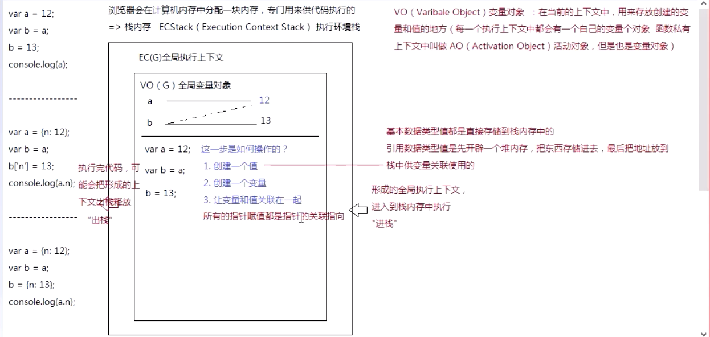

<!--
 * @Author: your name
 * @Date: 2020-03-22 19:32:35
 * @LastEditTime: 2020-04-22 16:42:47
 * @LastEditors: Please set LastEditors
 * @Description: In User Settings Edit
 * @FilePath: /webNotes/web/typeOf/index.md
 -->

### 常见的数据类型

- 基本数据类型

  > number
  > string
  > boolean
  > undefined
  > null
  > symbol
  > bigInt

- 引用数据类型
  > object
  > function

### Number()：直接调用浏览器底层的数据类型检测机制来完成

> true->1 false->0 null->0 undefined->NaN ""->0

> 字符串中必须保证都是有效数字才会转换为数字，否则都是 NaN

```javaScript
console.log('------------------')
console.log(parseInt("")) //NaN
console.log(Number("")) //0
console.log(isNaN("")) // false
console.log(parseInt(null)) // NaN
console.log(Number(null)) // 0
console.log(isNaN(null)) // false
console.log(parseInt('12px')) // 12
console.log(Number('12px')) //NaN
console.log(isNaN('12px')) //true
console.log(parseFloat('1.6px') + parseInt("1.2px") + typeof parseInt(null)) //'2.6number'
console.log(isNaN(Number(!!Number(parseInt("0.8"))))) //false
console.log(typeof !parseInt(null) + !isNaN(null)) // 'booleantrue'
let result = 10 + false + undefined + [] + 'Tencent' + null + true + {};
// 'NaNTencentnulltrue[object Object]'


```

### parseInt():处理的值是字符串，从字符串的左侧开始查找有效数字字符(遇到有效数字则停止查找)->如果处理的值不是字符串，需要先转换为字符串然后在开始查找接口

### 数据类型检测

- typeof:检测数据类型的逻辑运算符，Array 和 Object 都返回'object'

```javaScript
    console.log(typeof([1,2,3]))  //'object'
    console.log(typeof(333))      //'number'
    console.log(typeof({a:123}))  //'object'
```

- constructor:检测构造函数

```javaScript
    console.log([1, 2, 3].constructor == Array)  // true
    console.log({a:1}.constructor == Object)    // true
```

- instanceof:判断是否是某个类的实例

```javaScript
    console.log([1,2,3] instanceof Array)  //true
    console.log({a:123} instanceof Object) // true
```

Object.prototype.toString.call():不仅可以检测引用类型，还能检测普通的数据类型

```javaScript
    console.log(Object.prototype.toString.call([1, 2, 3]) == '[object Array]')  //true
console.log(Object.prototype.toString.call(333) == '[object Number]') //true
console.log(Object.prototype.toString.call({ a: 123}) == '[object Object]')  //true
```

## 隐式类型转换

1.隐式类型转换规则

> 转换成 string 类型 + ,转换成 number 类型：++/--(自增自减运算符) + - \* / %(算术运算符) > < >= <= == != === !=== (关系运算符)

> 转换成 boolean 类型 !(逻辑非运算符)

2. 字符串与算术运算符隐式转换规则混淆

- 字符串连接符:会把其他的数据类型调用 String()转成字符串然后进行拼接

- 算数运算符:会把其他的数据类型调用 Number()方法转换成数字然后做加法计算

```javaScript
    // + 是字符串连接:String(1)+'true'
    console.log(1+"true") // 1true
    // + 是算数运算符:1+Number(true) = 2
    console.log(1+true)   // 2
    // + 是算数运算符:1+Number(undefined) = NaN
    console.log(1+undefined)  //NaN
    // + 是算术运算符:1+Number(null) = 1
    console.log(1+null)      // 1
    // + 是算数运算符:1+Number([]) = 1
    console.log(1+[])   // 1
     // + 是算数运算符:1+Number({}) = NaN
    console.log(1+{})   // NaN
```

3.关系运算符：会把其他数据类型转换成 number 再进行比较

> 对象和字符串，对象转换为字符串

> null == undefined 但是和其他值都不相等

> 剩下两边不同的转换为数字

```javaScript
    // 当关系运算符两边一边是字符串，会将其他数据类型用Number转换，然后再进行比较
    console.log("2" > 10) // false
    // 两边都是数字都是字符串的时候使用unicode编码来转换成数字
    console.log("2" > "10") // true
    // 多个字符从左到右依次比较
    console.log("abc" > "b") //false
    // 比较aa然后b>a
    console.log("abd" > "aad") // true
    // 特殊情况无视规则
    console.log(undefined == undefined)  //true
    console.log(undefined == null)  //true
    console.log(null == false)  // false
    console.log(null == null) //true
    console.log(NaN == NaN) // false
```

4.复杂数据类型

- 复杂数据先使用 valueOf 方法获取其原始值，如果原始值不是 number 类型，则使用 toString()类型转成 string,再将 string 转成 number

```javaScript
    // 先将左边数据转成string，然后右边也是string则转成unicode编码运算
    console.log([1,2] == '1,2') //true

    var a = {}
    console.log(a == '[object Object]')  //true
    console.log(a.valueOf().toString()) //[object Object]
```

5.逻辑非隐式转换与关系运算符隐式转换搞混淆

- 关系运算符:将其他数据类型转换成数字类型

- 逻辑非：将其他数据类型转换成 Boolean 类型

- 八种数据类型转换为 Boolean 类型会得到 false [0,-0,NaN,undefined,null,"",false]

```javaScript
    //原理：[].valueOf().toString() 得到空字符串 Number("") == 0
    console.log([] == 0) // true
    //原理：！运算符优先级高于关系运算符，![] == false  (空数组布尔值得到true，然后取反得到false), false == 0
    console.log(![] == 0)  //true
    //原理：本质上是空对象{} 与 !{}这个逻辑非表达式结果做比较 {}.valeOf().toString()得到字符串"[object Object]"  !{} = false Number("[object Object]") == Number(false)
    console.log({} == !{})  //false
    // 引用类型数据存在堆中，栈中存储的是地址，所以结果是false
    console.log({}=={})      // false
    console.log([]==[])      //false
    console.log([] == {})   // false
    console.log({} == [])   // false
```

<br/>
> 值类型的工作原理

1.创建一个值 2.创建一个变量 3.让变量和值关联到一起


<br/>

> 引用类型

1.创建一个堆内存 2.把键值对存储到堆内存当中 3.堆内存放到栈当中，供变量调用

> 

### JS 底层运行机制

> ECStack(栈内存，计算机分配一块内存，全局执行的环境栈) 和 EC(代码自己执行的上下文环境)

> GO(Global Object):全局对象，存放在堆内存当中的 isNaN,alert 等方法

> Vo(Varibale Object):当前上下文当中，用来存放创建变量和值的地方

> Ao(Activation Object):私有变量对象

### 常见面试题

> typeof 返回的值是带''号的

```javaScript
    let a = typeof typeof typeof [12,23]
    console.log(a)  // 'string'
```

> typeof(NaN) == 'number'

```javaScript
    let res = parseFloat('left:200px')  //NaN
    if(res == 200){
        console.log(200)
    }else if(typeof res === 'number'){
        console.log('number')
    }else{
        console.log('Invalid Number')
    }
```

### 引用类型底层原理

```javaScript
    // 1.创建值
         // + 开辟一个堆
         // + 存储键值对
            // name:'cc'
            // fn:自执行函数执行，需要把obj.name传进来 -> undefined.name
    var obj = {
        name:'cc',
        fn:(function(x){
            console.log(x+10)
        })(obj.name)
    }
    obj.fn(3)
```
